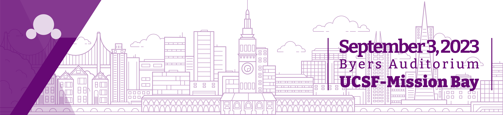

# Tsinghua BioMed Reunion | 2023

| 官方网站 | 微信公众号 | 联系邮箱 | 个人捐赠链接* |
| --- | --- | --- |  --- |
| [https://biomed-reunion.github.io/](https://biomed-reunion.github.io/) | [THUBioMed北美校友聚会](https://raw.githubusercontent.com/biomed-reunion/biomed-reunion.github.io/master/assets/Official-Account-QR.png) | biology@tsinghua.org | [PayPal](https://www.paypal.com/donate/?hosted_button_id=NHV4AEGKVCE6L) [**请务必添加备注“BioMed Reunion”**；如果您希望匿名（ID不出现在致谢名单中），请同时备注]|

\* 北加州清华校友会负责管理本年度聚会的捐款，可以为您的捐赠开具证明用于报税（如果您需要捐赠证明，请您同时备注，并附上您的邮箱）。

 

### 2023年清华生物医药北美校友聚会组委会

- 顾问：梁泽偲（08\*），孙沁雨（08），赵毓（09），盛心磊（09），丁鸿绪（09），杨天放（10），范潇（10），丁霄哲（10），孙笑尘（10），马婧（10）

- 统筹：刘松雷，刘志凯

- 外联&财务：赵毓（09），侯怡然，吕婉晴，刘松雷，谭翔天，陈子奇（12）

- 注册信息管理&邮件应答：方言

- 场务：
  - 场地：杜晋
  - 茶歇&简餐：陈安芝（药学院）

- 嘉宾联络：宋博锴，杜晋，吕婉晴，刘松雷，刘志凯，吉迎，谭翔天，陈子奇（12），王意翔（12），周镜天（药学院12）

- 宣传：
  - 网站：陈楚，侯凌峰
  - 微信公众号：刘玥
  - 纪念品：王珣

\* 注：括号内年份表示入学清华大学（生命科学学院/生物科学与技术系）的年份，无标示则均为11级

 

### 协办

- 北加州清华校友会

- [Association of Chinese Students and Scholars at UCSF](https://ucsf.campusgroups.com/acss/home/)

 

### 特别鸣谢

- 活动赞助：

  - 钻石级赞助：[Taimei Technology](https://prod.taimei.com/en/)
 
  - 铂金级赞助：[百奥赛图](https://www.biocytogen.com.cn/)，[GenScript](https://www.genscript.com/)，孙中平（清华大学电子系82级、生研87级校友）与廖国娟（生研86级校友）
 
  - 黄金级赞助：[Superstring Capital Management LP](https://www.superstringcap.com/)
 
  - 友情赞助：匿名校友

- 宣传协力：段媛慧（清华大学生命科学学院校友与发展办公室），王燎腾（清华大学生物科学与技术系92级校友、“北美清华生医药学院校友群”微信群群主）

- 纪念品设计与定制顾问：宋宇寰（清华大学美术学院12级校友）等

<!--
**biomed-reunion/biomed-reunion** is a ✨ _special_ ✨ repository because its `README.md` (this file) appears on your GitHub profile.
-->
